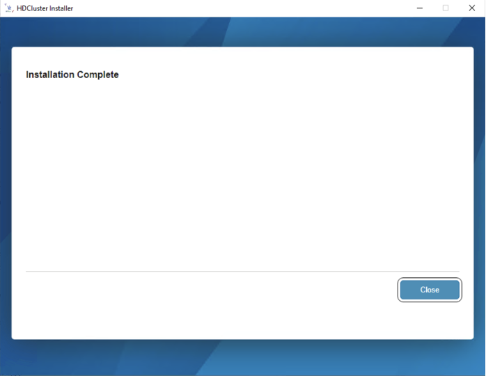
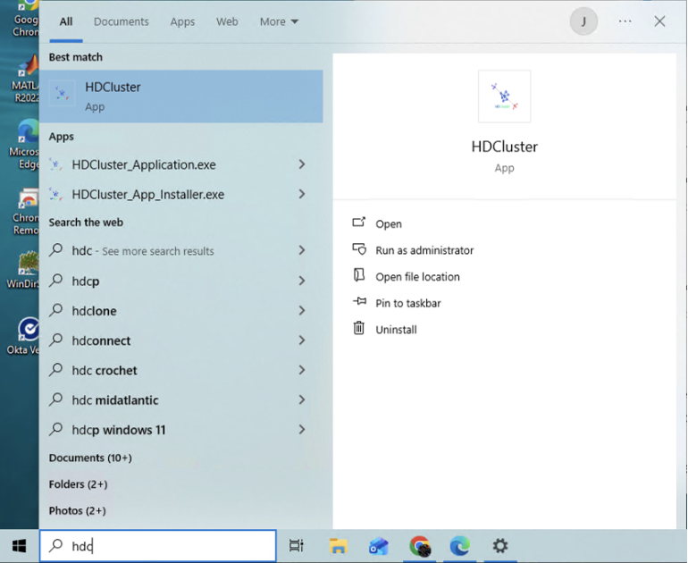

### Windows Installation Guide

1.  Double-click the `HDCluster_App_Installer.exe` file to launch the installer. Click **Next** to continue.

3.  Choose the destination folder for the installation. The default is `C:\Program Files\HDCluster`, but you can select a different location. You can also add a shortcut to your desktop. Click **Next**.

5.  The installer will check for the MATLAB Runtime (MCR). If it's not found, it will be downloaded and installed from the web. Click **Begin Install** to start the process.
[HDCluster Image 3](HDCluster_images/img3.png)

7.  Once the installation is complete, click **Close** to exit the wizard.

9.  You can now launch the HDCluster application from the Start Menu or your desktop shortcut.

