# HDCluster Documentation
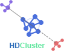

## Overview

HDCluster is available as a preprint on `bioRxiv` 
(**DOI:** https://doi.org/10.1101/2025.10.23.684134). 

HDCluster is a simple, yet powerful, one-parameter spatial clustering method. It is designed to be scalable, robust to noise, and exceptionally fast, making it suitable for handling very large datasets, such as those generated by DNA-PAINT Single Molecule Localization Microscopy (SMLM). 

HDCluster can be used as a standalone tool with a denoising option, or as a module within a larger computational pipeline to retrieve clustered localizations. Its versatility allows it to be applied to both biological and non-biological data.

One of the key advantages of HDCluster is its minimal calibration requirement. It relies on a single parameter that can be set based on the physical characteristics of the clusters, such as their size. This parameter can be determined by analyzing the scale of clustering with a global H-Ripley's function or by measuring the spread of a known cluster within the data.

HDCluster's strength lies in its ability to identify clusters of various shapes and densities while automatically filtering out noisy localizations. By combining density-based clustering with graph-based techniques, HDCluster provides robust and accurate cluster identification in SMLM datasets, which is crucial for precise emitter reconstruction and other super-resolution microscopy applications.

## Installation

A compiled version of HDCluster is available for  Windows. The installation process is straightforward.

1.  Locate the `HDCluster_App_Installer` file and double-click it to begin the installation.
2.  Follow the setup wizard to install HDCluster on your computer.

HDCluster requires the MATLAB Runtime (MCR), which will be installed automatically if it is not already present on your system. The MCR is a freely available set of shared libraries required to run the software. Please note that administrator privileges are required to install the MCR.

### Windows Installation Guide

1.  Double-click the `HDCluster_App_Installer.exe` file to launch the installer. Click **Next** to continue.
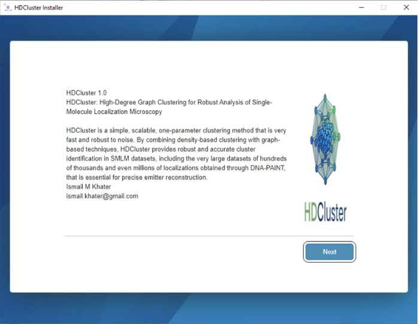

3.  Choose the destination folder for the installation. The default is `C:\Program Files\HDCluster`, but you can select a different location. You can also add a shortcut to your desktop. Click **Next**.
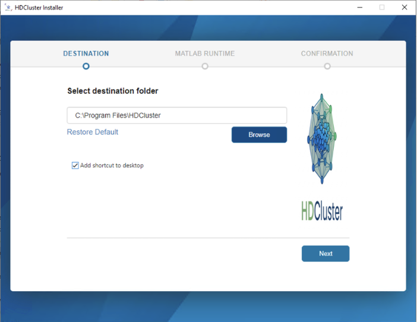

5.  The installer will check for the MATLAB Runtime (MCR). If it's not found, it will be downloaded and installed from the web. Click **Begin Install** to start the process.
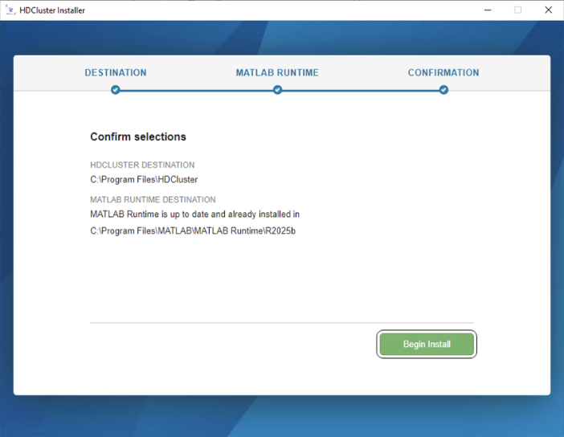

7.  Once the installation is complete, click **Close** to exit the wizard.
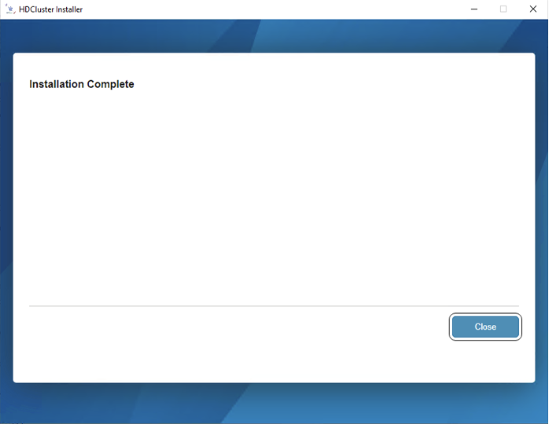

9.  You can now launch the HDCluster application from the Start Menu or your desktop shortcut.
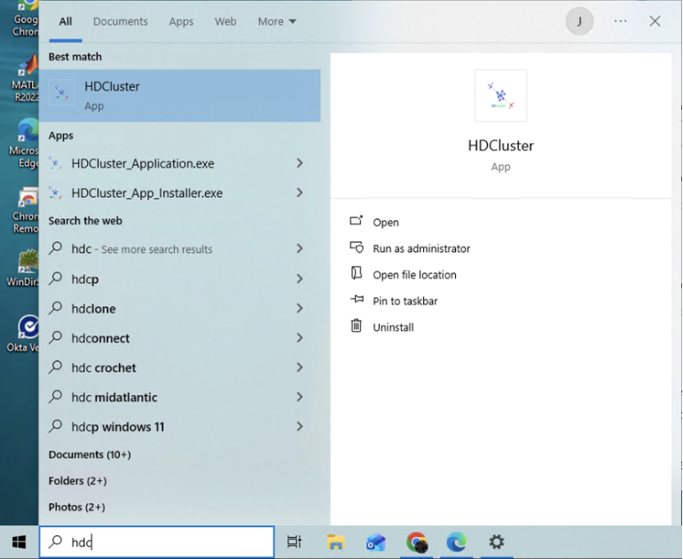

## Supported Data Formats

HDCluster supports a variety of file formats, including:

*   `.txt`
*   `.hdf5`
*   `.csv`
*   `.xyz`
*   `.3dlp`
*   ASCII files

Regardless of the file format, the file must contain a header with acquisition information for the localizations. For 2D data, the file must include `X` and `Y` columns. For 3D data, `X`, `Y`, and `Z` columns are required. Please ensure that the column labels do not contain prefixes or postfixes (e.g., use `X` instead of `X (nm)`).

Below are examples of sample files in both 2D and 3D formats. Each example illustrates the file header, which contains metadata and parameters, followed by a preview of the first few rows of localization data.

*   Sample `.txt` file data
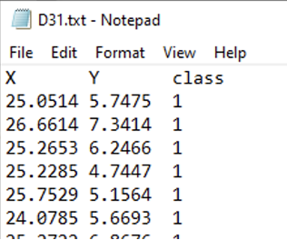
 
*   Sample `.csv` file data
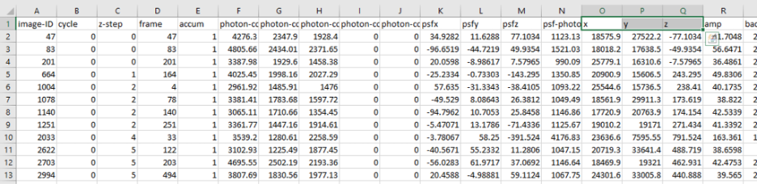

## Using HDCluster

### Loading and Visualizing Data

The **Load Data** tab allows you to load and visualize your dataset. 
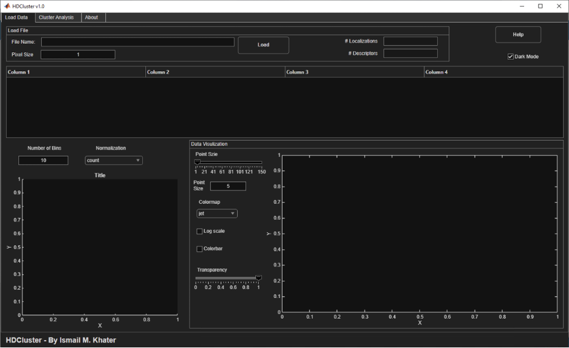

1.  Load your data file.
2.  Click on any column header to color the visualized data by that column and display a histogram of the selected data, providing insight into its distribution.

Users can sort localizations by clicking the up/down arrows in the column headers. The application also provides options to change the histogram normalization method and customize the point visualization by adjusting the size, colormap, and transparency.
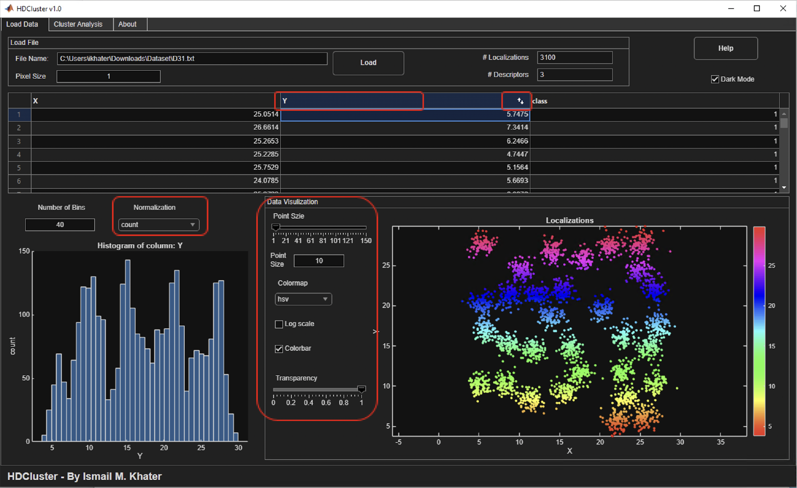

Interactive plot features include zooming, panning, and rotating the data (for 3D). You can also view the data in various projections (e.g., XY, XZ). Right-clicking on the plot reveals a context menu with additional visualization functions. Figures can be saved in various formats using the save icon in the plot's tooltip.
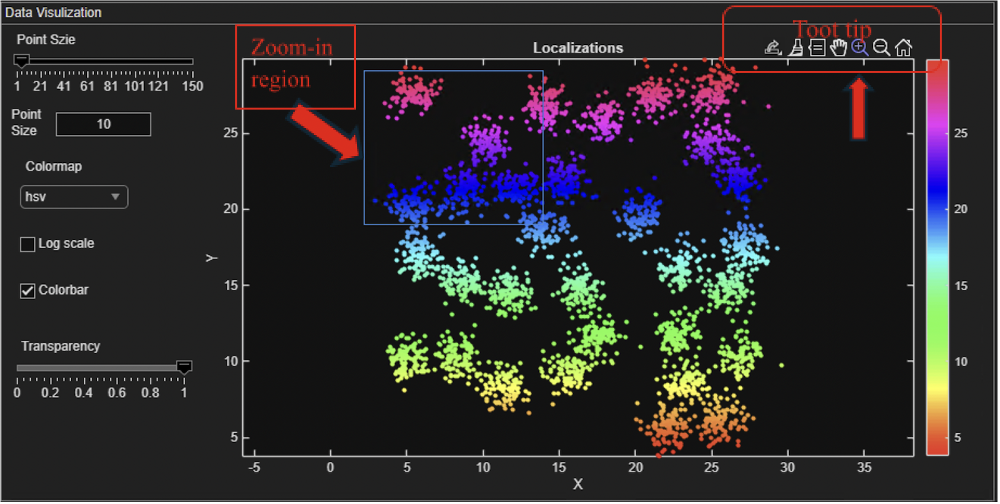

### Setting Pixel Size

In the **Load Data** tab, you can specify the pixel size of your data. For example, for DNA-PAINT data with a pixel size of 130 nm, you would enter `130` in the pixel size text field.
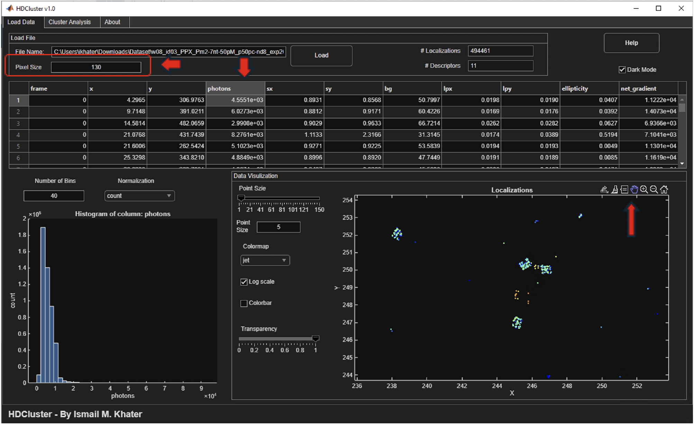

### Cluster Analysis

1.  Navigate to the **Cluster Analysis** tab.
2.  Set the `mTh` parameter.
3.  Enable or disable the denoising option as needed.
4.  After running the analysis, the localizations will be color-coded in the plot according to their identified cluster memberships.
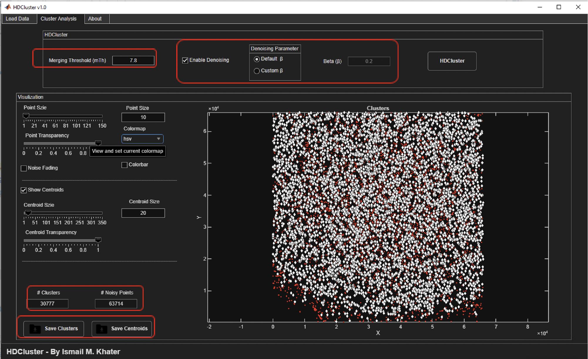

The resulting clustered localizations and reconstructed binding sites can be saved as CSV files for further analysis.

