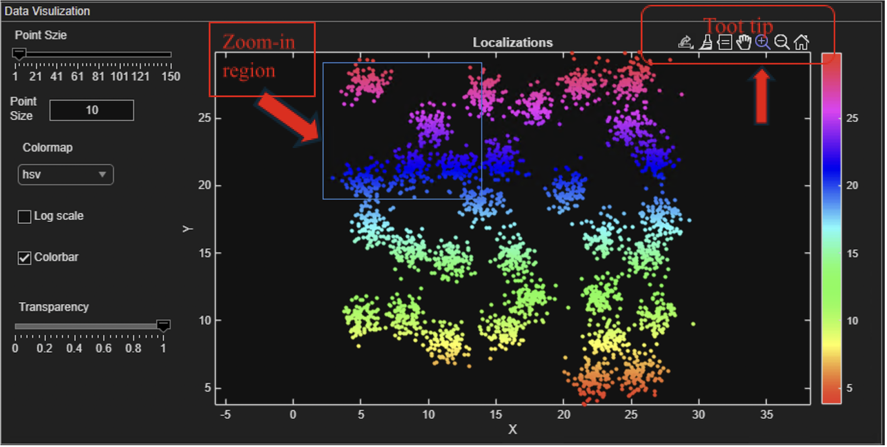
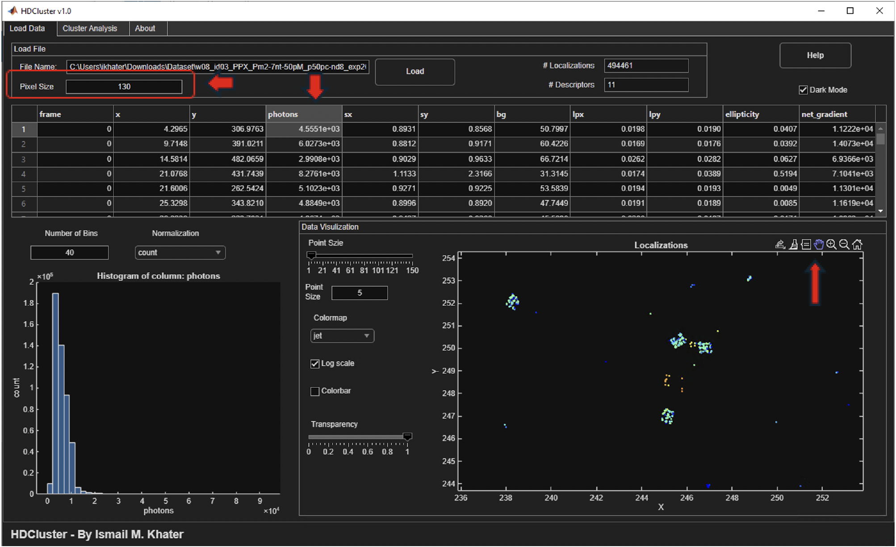

## 🚀 Using HDCluster

### Loading and Visualizing Data

The **Load Data** tab allows you to load and visualize your dataset. 

1.  Load your data file.
2.  Click on any column header to color the visualized data by that column and display a histogram of the selected data, providing insight into its distribution.

Users can sort localizations by clicking the up/down arrows in the column headers. The application also provides options to change the histogram normalization method and customize the point visualization by adjusting the size, colormap, and transparency.

Interactive plot features include zooming, panning, and rotating the data (for 3D). You can also view the data in various projections (e.g., XY, XZ). Right-clicking on the plot reveals a context menu with additional visualization functions. Figures can be saved in various formats using the save icon in the plot's tooltip.

### Setting Pixel Size

In the **Load Data** tab, you can specify the pixel size of your data. For example, for DNA-PAINT data with a pixel size of 130 nm, you would enter `130` in the pixel size text field.

### Cluster Analysis

1.  Navigate to the **Cluster Analysis** tab.
2.  Set the `mTh` parameter.
3.  Enable or disable the denoising option as needed.
4.  After running the analysis, the localizations will be color-coded in the plot according to their identified cluster memberships.

The resulting clustered localizations and reconstructed binding sites can be saved as CSV files for further analysis.
